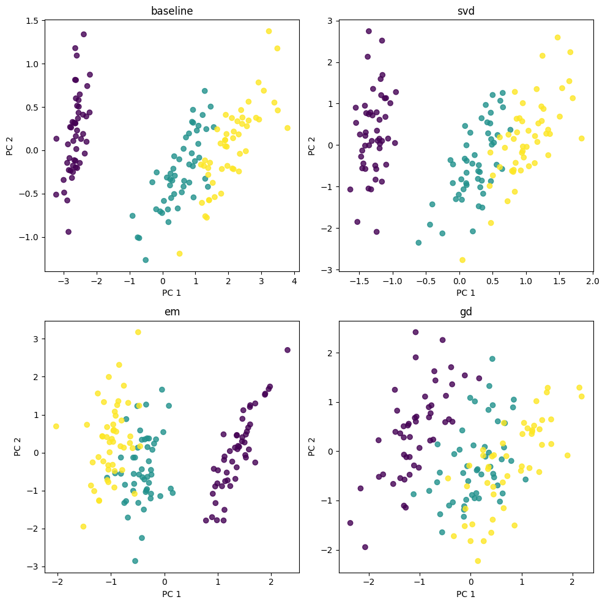
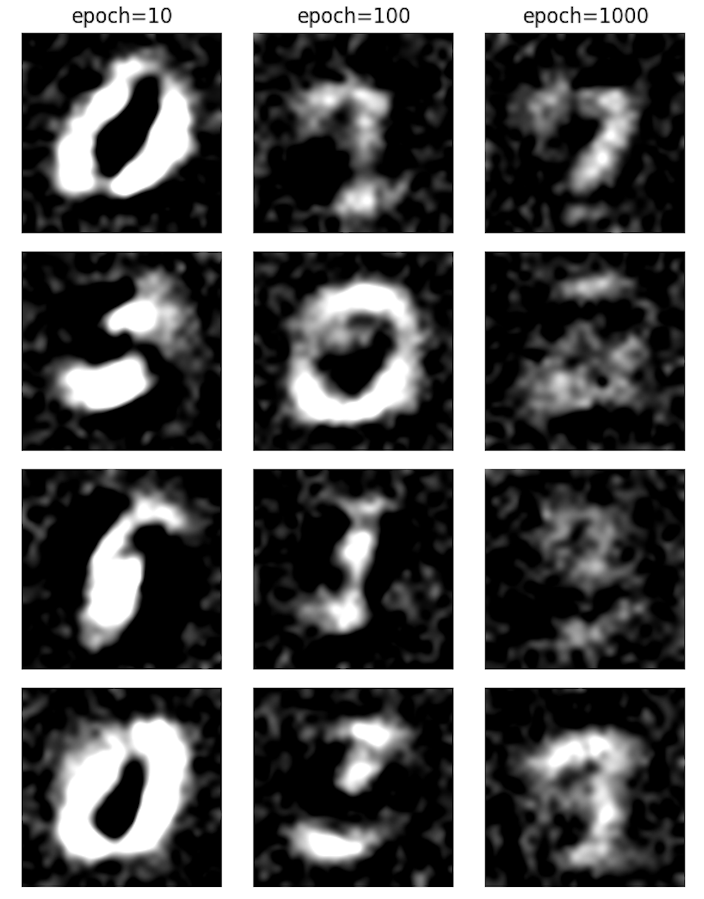

# PPCA
Probabilistic PCA (PPCA) + MPPCA written in torch.

## Overview

`ppca-torch` implements in PyTorch the method Probabilistic Principal Component Analysis (PPCA) as described by Tipping & Bishop (1999). It provides also a PCA implementation and the `sklearn` implementation ("baseline"). Additionaly, it contains also the extension to MPPCA. Examples and notebooks allow to see: 
- comparison between different ways to learn the parameters of the model (convergence and projections)
- sampling examples from MNIST
- comparison of projections on PCA vs. PPCA
- missing values impact with MPPCA




The repository is organised as follows:
- `src/ppca` contains the source code for PPCA, MPPCA and PCA implementations.
- `notebooks` contains visual experiments
- `examples` show more scripts that enable to test various things like compare the convergence of methods, sample from a model trained on MNIST, compare PCA and PPCA etc.
- `figures` have some interesting plots



## Quickstart

### Dev mode

First, create (`python3 -m venv .venv`) or activate a virtualenv `source .venv/bin/activate`.

Then clone the repository and install:
```
git clone https://github.com/siemovit/ppca.git
cd ppca
pip install -e .
```

## References
[Tipping, Michael E., and Christopher M. Bishop. "Probabilistic principal component analysis." Journal of the Royal Statistical Society Series B: Statistical Methodology 61.3 (1999): 611-622.](https://www.di.ens.fr/~fbach/courses/fall2005/Bishop_Tipping_1999_Probabilistic_PCA.pdf)